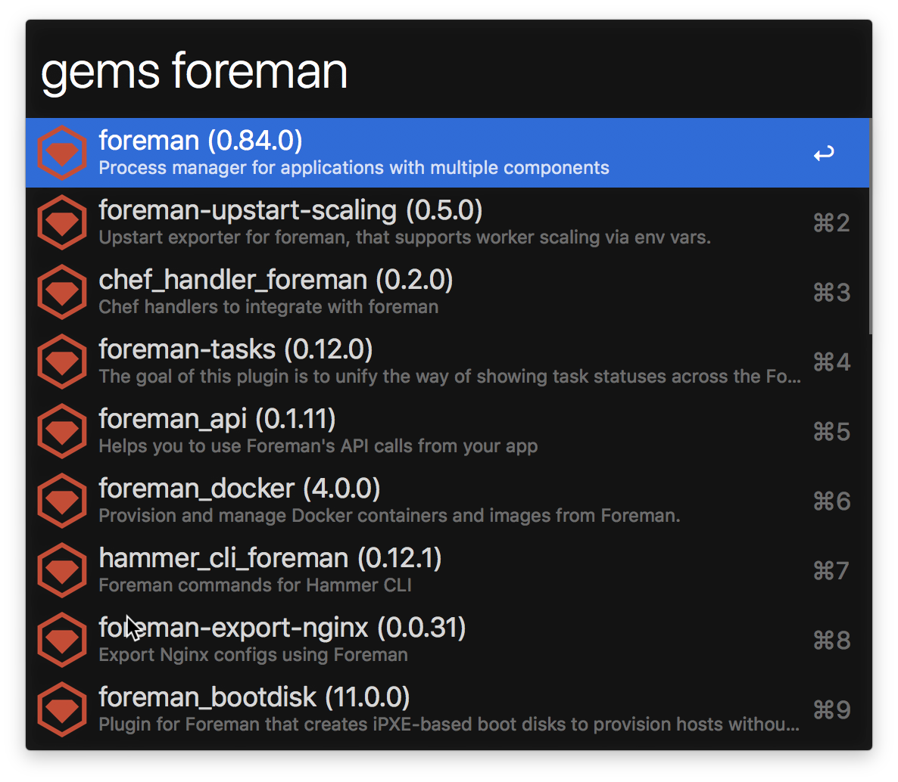

# Gems for Alfred

A workflow for searching RubyGems on Alfred.

## Install

Download [gems.alfredworkflow](https://github.com/nanoxd/pods.alfredworkflow/releases/latest)

## Usage

In Alfred, type `gems` followed by a gem name.

Pressing <kbd>Enter</kbd> will open the RubyGems page in your browser. If you'd like to go to the source code, you can press <kbd>Option (⌥)</kbd>+<kbd>Enter</kbd>

While over an item, you can copy the stanza `gem 'jekyll', '~> 3.7.0'` to put in your Gemfile using <kbd>⌘C</kbd>.

## License

[MIT](https://tldrlegal.com/license/mit-license)
